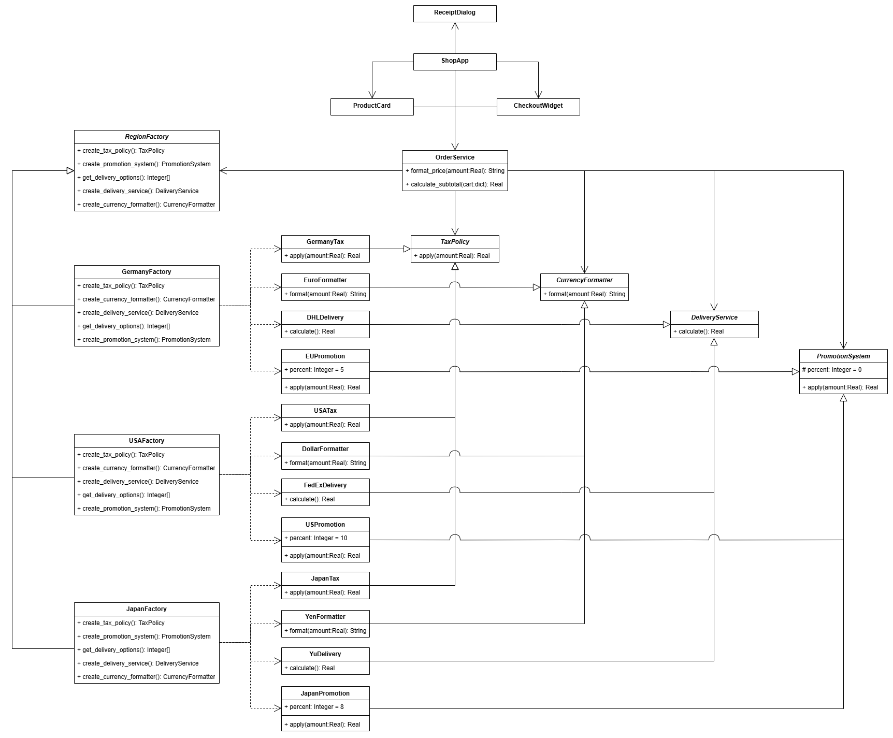

# Лабораторная работа №1  

## Описание проблемы предметной области

В рамках предметной области рассматривается настольное приложение - международный интернет-магазин.  

Основная проблема заключается в том, что при оформлении заказа для разных стран используются различные:

- налоговые ставки (НДС / sales tax);
- форматы отображения валюты;
- службы доставки и их стоимость;
- правила применения скидок.

Логика расчётов и форматирования отличается в зависимости от выбранного региона (Германия, США или Япония).  

Если реализовывать поддержку стран через условные операторы (`if/else` по региону), клиентский код был бы перегружен проверками и созданием конкретных классов напрямую. Это привело бы к:

- усложнению сопровождения программы;
- трудностям при добавлении новой страны;
- риску несовместимости компонентов.

## Решение

Для решения данной проблемы был применён порождающий паттерн **Абстрактная фабрика**. Суть решения заключается в том, что создание семейства взаимосвязанных объектов выносится из клиентского кода в отдельную иерархию фабрик.

В системе определена абстрактная фабрика `RegionFactory`, которая задаёт общий интерфейс создания компонентов, необходимых для расчёта и оформления заказа. Клиентский код работает именно с этой абстракцией, не создавая конкретные классы напрямую.

Для каждой конфигурации реализована собственная конкретная фабрика (`GermanyFactory`, `USAFactory`, `JapanFactory`). Каждая из них создаёт полный совместимый набор объектов, относящихся к одному семейству. Это исключает смешивание логики разных регионов.

В качестве абстрактных продуктов выступают:
- `TaxPolicy`,
- `CurrencyFormatter`,
- `DeliveryService`,
- `PromotionSystem`.

**Абстрактные продукты и их реализация в конкретных странах**
| Абстрактный продукт | Германия        | США            | Япония        |
|--------------------|-----------------|---------------|--------------|
| TaxPolicy          | GermanyTax     | USATax       | JapanTax     |
| CurrencyFormatter  | EuroFormatter  | DollarFormatter | YenFormatter |
| DeliveryService    | DHLDelivery    | FedExDelivery | YuDelivery   |
| PromotionSystem    | EUPromotion    | USPromotion   | JapanPromotion |

Клиентом паттерна является класс `OrderService`, который получает фабрику и через неё инициализирует все необходимые компоненты. Графический интерфейс (`ShopApp`) позволяет переключать конфигурацию во время работы программы: при смене региона создаётся новая фабрика, после чего система автоматически начинает использовать соответствующее семейство объектов.

Таким образом, паттерн обеспечивает создание согласованных наборов компонентов, снижает связанность клиентского кода с конкретными реализациями и упрощает расширение системы новыми конфигурациями.

## Диаграмма классов

.

## Выводы

Использование паттерна **Abstract Factory** позволило структурировать архитектуру приложения таким образом, чтобы создание взаимосвязанных компонентов осуществлялось через абстракции, а не через прямую работу с конкретными классами.

Внедрение паттерна дало следующие преимущества:

- обеспечено создание согласованных семейств объектов для каждой конфигурации;
- исключено смешивание логики различных регионов, что повысило надёжность работы системы;
- снижена связанность клиентского кода с конкретными реализациями, что упростило поддержку и сопровождение программы;
- реализация принципа открытости/закрытости (OCP) позволила добавлять новые конфигурации без изменения существующего кода;
- архитектура стала более гибкой и расширяемой, что облегчает дальнейшее развитие проекта.

Таким образом, применение паттерна **Абстрактная фабрика** положительно повлияло на структуру программы, сделав её более модульной и устойчивой к изменениям.
