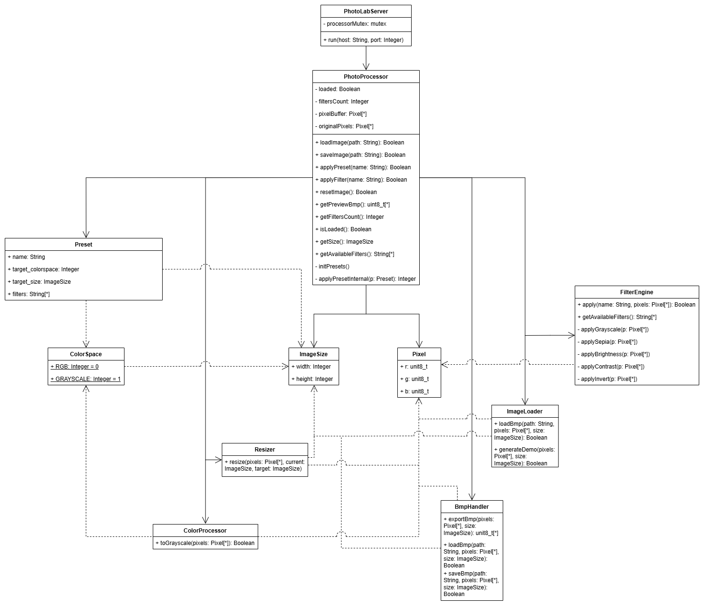

# Лабораторная работа №2: Фасад

## Предметная область

Веб-приложение для обработки растровых изображений в формате BMP. Пользователь через браузер может:
- **Загружать изображения** — файлы BMP или генерировать демо-изображение;
- **Применять фильтры** — оттенки серого, сепия, яркость, контраст, инверсия;
- **Использовать пресеты** — предустановленные комбинации фильтров и параметров;
- **Просматривать результат** — предпросмотр в реальном времени;
- **Сохранять результат** — экспорт обработанного изображения в BMP.

### Проблема

Система состоит из четырёх независимых подсистем, каждая со своим интерфейсом:

1. **BmpHandler** — отвечает за чтение/запись файлов, упаковку пикселей с выравниванием строк.

2. **ImageLoader** — загрузка изображений из файла или генерация демо-изображения. Координирует выбор источника (файл или демо), делегирует работу с файлами BmpHandler.

3. **FilterEngine** — применение визуальных эффектов. Содержит пять алгоритмов обработки пикселей, каждый со своей математикой преобразования цветов.

4. **Resizer** — изменение размеров изображения, требует расчёта координат исходных пикселей для каждого пикселя результата.

Без паттерна клиентский код вынужден:
- Знать API всех четырёх подсистем и порядок их вызовов;
- Управлять состоянием: буфер пикселей, текущий размер, оригинал для сброса, счётчик применённых фильтров;
- Координировать цепочки операций: загрузка, применение фильтров, изменение размера, конвертация цветового пространства, экспорт;
- Обрабатывать пресеты: последовательное применение фильтров, расчёт пропорций при изменении размера.

Все подсистемы в таком варианте реализуются в клиенте, что делает код сервера перегруженным и трудным для поддержки.

## Решение: паттерн Фасад

**Фасад** предоставляет унифицированный интерфейс вместо набора интерфейсов подсистемы. Определяет интерфейс более высокого уровня, который упрощает использование подсистемы.

В проекте фасадом является класс **PhotoProcessor**, который предоставляет клиенту (PhotoLabServer) набор высокоуровневых методов:
- `loadImage(path)` — загрузка изображения из файла или демо-режима;
- `saveImage(path)` — сохранение текущего состояния в файл;
- `applyFilter(name)` — применение одного фильтра к изображению;
- `applyPreset(name)` — применение пресета;
- `resetImage()` — сброс к оригинальному изображению;
- `getPreviewBmp()` — экспорт текущего состояния для предпросмотра;
- `getAvailableFilters()`, `getSize()`, `isLoaded()` — запрос метаданных.

Клиент не знает о существовании BmpHandler, ImageLoader, FilterEngine и Resizer. Он отправляет команду и получает результат: успешность операции, количество применённых фильтров, данные для отображения.

### Обработка пресетов

Пресет — это конфигурация обработки, содержащая:
- Целевое цветовое пространство (RGB или GRAYSCALE);
- Целевой размер (ширина, высота; высота=0 означает авто-расчёт по пропорциям);
- Список фильтров для последовательного применения.

Фасад координирует выполнение пресета:
1. Сброс к оригинальному изображению;
2. Последовательное применение фильтров из списка;
3. Конвертация в оттенки серого, если указано в пресете;
4. Масштабирование, если указан целевой размер;
5. Возврат количества применённых операций.

## Диаграмма классов

`.

## Два варианта реализации

Проект содержит две полноценные реализации с идентичной функциональностью:

### С паттерном

Сервер вызывает только методы фасада: `processor.loadImage()`, `processor.applyPreset()`, `processor.getPreviewBmp()`. Вся координация подсистем, управление состоянием и логика пресетов скрыты внутри `PhotoProcessor`.

### Без паттерна

Сервер сам координирует все вызовы: загрузка → буфер → фильтры → ресайз → экспорт. Тот же результат, но код сервера значительно сложнее: дублирование логики управления состоянием, прямые зависимости от всех подсистем.

## Вывод

Внедрение паттерна Фасад значительно упростило архитектуру приложения:

1. **Уменьшение связности.** `PhotoLabServer` зависит только от `PhotoProcessor`, а не от нескольких подсистем с десятками методов. При изменении внутреннего API подсистемы (например, добавлении нового фильтра в `FilterEngine`) клиентский код сервера не затрагивается.

2. **Инкапсуляция состояния.** Логика управления буфером пикселей, хранение оригинала для сброса, подсчёт применённых фильтров, расчёт пропорций при ресайзе — всё скрыто за простым интерфейсом.

3. **Независимость подсистем.** `BmpHandler`, `FilterEngine`, `Resizer` ничего не знают о фасаде и могут использоваться по отдельности.

4. **Производительность.** В ходе тестирования версия без паттерна показала более высокое быстродействие. Это связано с меньшим количеством вызовов методов-обёрток.
   
**Итог:** Паттерн Фасад позволил разделить ответственность между слоями приложения, упростить клиентский код и повысить гибкость архитектуры, но при этом привел к небольшой потери производительности.
