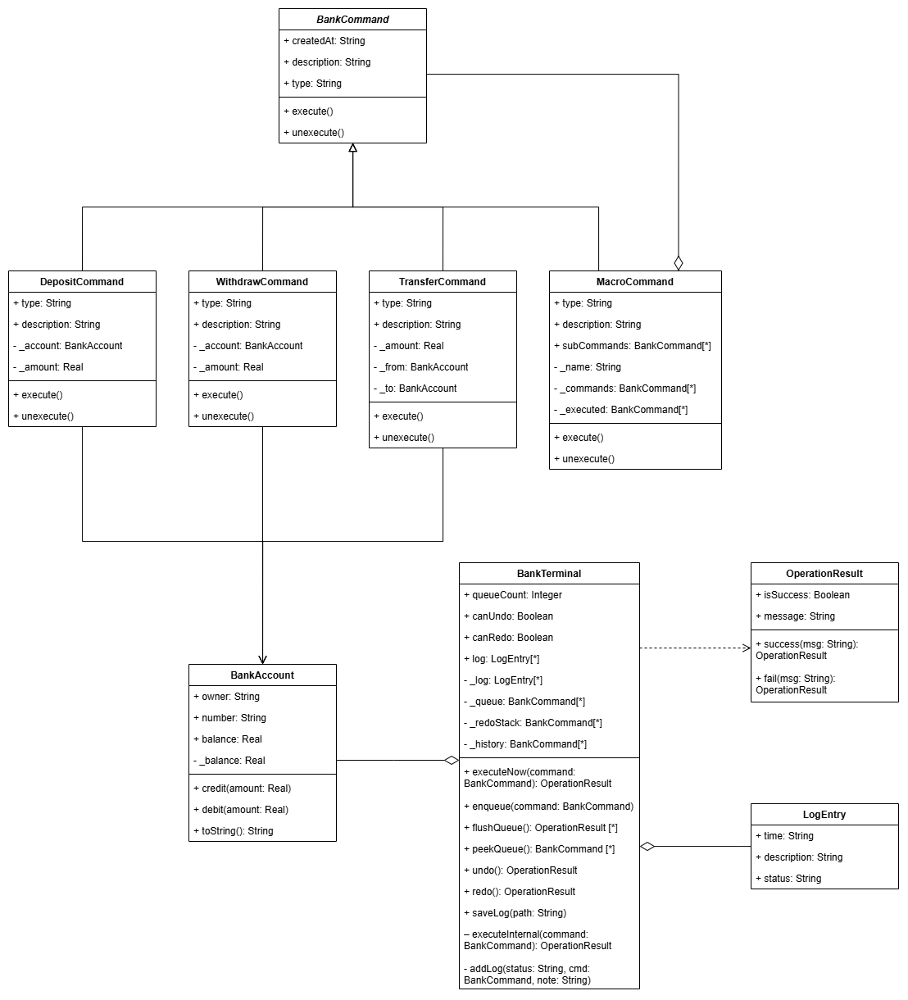

# Лабораторная работа №3: Команда

## Предметная область

Настольное приложение банковского терминала, где возможно:

- **Управлять счетами** - просматривать баланс клиентов в табличном виде;
- **Выполнять операции** - пополнение (депозит), снятие, перевод между счетами;
- **Использовать макрокоманды** - формировать пакет операций и выполнять его как единое целое;
- **Управлять очередью** - откладывать операции в очередь и запускать их пакетно;
- **Отменять и повторять** - откатывать последнее действие (Undo) и возвращать его (Redo);
- **Сохранять журнал** - экспортировать историю всех операций в текстовый файл.

## Проблема

Без паттерна терминал работает напрямую с объектами счетов, встраивая логику операций прямо в класс `BankTerminal`. Это порождает ряд проблем:

- **Дублирование логики операций.** Методы `Deposit`, `Withdraw`, `Transfer`, `ExecuteMacro` содержат почти идентичный код обработки ошибок, формирования описания и записи в журнал - всё это повторяется в каждом методе.
- **Сложная история для Undo/Redo.** Чтобы откатить операцию, терминал хранит объекты `HistoryEntry` с типом операции и параметрами, а затем вручную восстанавливает состояние через `switch` в методах `RollbackEntry` и `ReapplyEntry`.
- **Разнородные структуры очереди и истории.** Для очереди используется отдельный класс `QueueEntry`, для истории - `HistoryEntry`. Оба хранят практически одни и те же поля (тип, счёт, сумма, описание), но не имеют общего интерфейса.

## Решение: паттерн Команда

Паттерн **Команда** инкапсулирует запрос как объект, тем самым позволяя параметризовать клиентов с различными запросами, организовывать очередь, а также поддерживать отменяемые операции.

В проекте абстрактным командным интерфейсом является класс `BankCommand`, который объявляет два метода: `Execute()` - выполнить операцию, и `Unexecute()` - отменить её. Каждая конкретная команда (`DepositCommand`, `WithdrawCommand`, `TransferCommand`) сама знает, как выполнить и откатить своё действие. Класс `MacroCommand` реализует составную команду - он содержит список команд и выполняет их последовательно, а откатывает в обратном порядке.

Роль **инвокера** выполняет класс `BankTerminal`. Он не знает деталей операций - он лишь вызывает `Execute()` и `Unexecute()` у объектов команд, складывает выполненные команды в стек истории и управляет очередью.

## Обработка макрокоманд

`MacroCommand` является составной командой. Он хранит список дочерних команд любого типа - в том числе других `MacroCommand` - и реализует следующую логику:

- При вызове `Execute()` последовательно выполняет каждую дочернюю команду, фиксируя выполненные в отдельном списке `_executed`;
- При вызове `Unexecute()` откатывает выполненные команды в обратном порядке;
- Если в середине выполнения возникает ошибка (например, недостаточно средств), исключение всплывает наверх, и `BankTerminal` самостоятельно останавливает выполнение, не затрагивая уже применённые подкоманды - их можно откатить через общий механизм Undo.

## Диаграмма классов

.

## Два варианта реализации

Проект содержит две полноценные реализации с идентичной функциональностью пользовательского интерфейса:

### С паттерном

`BankTerminal` работает исключительно с абстракцией `BankCommand`. Метод `ExecuteNow(BankCommand)` принимает любую команду (депозит, снятие, перевод или макрос) и выполняет её единообразно: `command.Execute()`, затем помещает в стек истории. Undo и Redo реализованы в три строки - достать команду из стека, вызвать `Unexecute()` или `Execute()`. Добавление нового типа операции не требует изменений в `BankTerminal` - достаточно создать новый класс-наследник `BankCommand`.

### Без паттерна

`BankTerminal` содержит отдельные методы для каждой операции: `Deposit`, `Withdraw`, `Transfer`, `ExecuteMacro`. Для очереди и истории используются разные классы (`QueueEntry`, `HistoryEntry`) с перечислением `OperationType`. Логика отката реализована через `switch` в методах `RollbackEntry` и `ReapplyEntry`. При добавлении нового типа операции необходимо изменить `BankTerminal`, оба вспомогательных класса и оба `switch`-блока.

## Вывод

Внедрение паттерна Команда существенно улучшило архитектуру приложения:

**Единообразие операций.** Депозит, снятие, перевод и макрос - все команды имеют одинаковый интерфейс (`Execute` / `Unexecute`). `BankTerminal` работает с ними через один метод, не зная деталей каждой операции.

**Упрощение Undo/Redo.** В версии без паттерна для отката используется `switch` с ручным восстановлением состояния счетов. В версии с паттерном каждая команда сама знает, как себя отменить - `BankTerminal` просто вызывает `Unexecute()`.

**Итог:** Паттерн Команда позволил отделить инициатора операций (`BankTerminal`) от логики их выполнения (конкретные команды), устранить дублирование кода и получить гибкий механизм истории операций. Единственный компромисс - увеличение числа классов в проекте.
